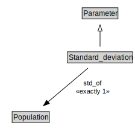

# Standard_deviation

<a href="../../diagrams/i72__Standard_deviation.dot.svg">Open interactive Standard_deviation diagram</a>

## Formalization for Standard_deviation

| Property | Constraint |
|----------|------------|
| std_of | exactly 1 owl::Thing |
| subClassOf | Parameter |

