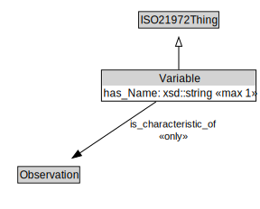

# Variable

<a href="../../diagrams/i72__Variable.dot.svg">Open interactive Variable diagram</a>

## Formalization for Variable

| Property | Constraint |
|----------|------------|
| has_Name | max 1 owl::Thing |
| is_characteristic_of | all Observation |
| subClassOf | ISO21972Thing |

