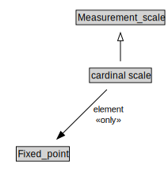

# cardinal scale

<a href="../../diagrams/i72__cardinal scale.dot.svg">Open interactive cardinal scale diagram</a>

## Specializations of cardinal scale

| Class | Description |
|-------|-------------|
| [Cardinality_scale (i72)](i72__Cardinality_scale.md) |  |
| [interval scale](i72__interval scale.md) |  |
| [ratio scale](i72__ratio scale.md) |  |

## Formalization for cardinal scale

| Property | Constraint |
|----------|------------|
| element | all Fixed_point |
| subClassOf | Measurement_scale |

