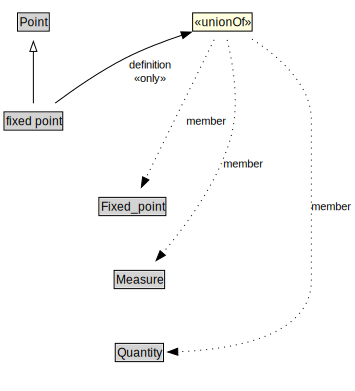

# fixed point

<a href="../../diagrams/i72__fixed point.dot.svg">Open interactive fixed point diagram</a>

## Specializations of fixed point

| Class | Description |
|-------|-------------|
| [fixed zero point](i72__fixed zero point.md) |  |

## Formalization for fixed point

| Property | Constraint |
|----------|------------|
| definition | all Fixed_point or Measure or Quantity |
| subClassOf | Point |

## Used by classes

| Class | Property |
|-------|----------|
| [cardinal scale](i72__cardinal scale.md) | element |

