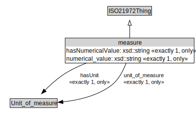

# measure

<a href="../../diagrams/i72__measure.dot.svg">Open interactive measure diagram</a>

## Formalization for measure

| Property | Constraint |
|----------|------------|
| hasNumericalValue | all xsd::string |
| hasNumericalValue | exactly 1 owl::Thing |
| hasUnit | all Unit_of_measure |
| hasUnit | exactly 1 owl::Thing |
| numerical_value | all xsd::string |
| numerical_value | exactly 1 owl::Thing |
| subClassOf | ISO21972Thing |
| unit_of_measure | all Unit_of_measure |
| unit_of_measure | exactly 1 owl::Thing |

## Used by classes

| Class | Property |
|-------|----------|
| [quantity](i72__quantity.md) | hasValue |
| [quantity](i72__quantity.md) | value |

