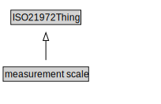

# measurement scale

<a href="../../diagrams/i72__measurement scale.dot.svg">Open interactive measurement scale diagram</a>

## Specializations of measurement scale

| Class | Description |
|-------|-------------|
| [cardinal scale](i72__cardinal scale.md) |  |
| [Cardinality_scale (i72)](i72__Cardinality_scale.md) |  |
| [interval scale](i72__interval scale.md) |  |
| [nominal scale](i72__nominal scale.md) |  |
| [ordinal scale](i72__ordinal scale.md) |  |
| [ratio scale](i72__ratio scale.md) |  |

## Formalization for measurement scale

| Property | Constraint |
|----------|------------|
| subClassOf | ISO21972Thing |

## Other annotations

| Annotation | Value |
|------------|-------|
| om-1::alternative_label | scale |

