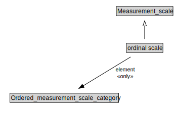

# ordinal scale

<a href="../../diagrams/i72__ordinal scale.dot.svg">Open interactive ordinal scale diagram</a>

## Formalization for ordinal scale

| Property | Constraint |
|----------|------------|
| element | all Ordered_measurement_scale_category |
| subClassOf | Measurement_scale |

