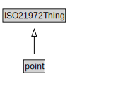

# point

<a href="../../diagrams/i72__point.dot.svg">Open interactive point diagram</a>

## Specializations of point

| Class | Description |
|-------|-------------|
| [fixed point](i72__fixed point.md) |  |
| [fixed zero point](i72__fixed zero point.md) |  |

## Formalization for point

| Property | Constraint |
|----------|------------|
| subClassOf | ISO21972Thing |

