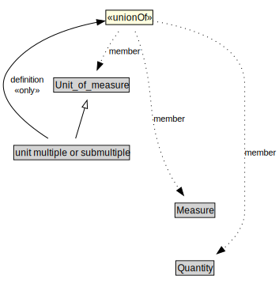

# unit multiple or submultiple

<a href="../../diagrams/i72__unit multiple or submultiple.dot.svg">Open interactive unit multiple or submultiple diagram</a>

## Formalization for unit multiple or submultiple

| Property | Constraint |
|----------|------------|
| definition | all Measure or Quantity or Unit_of_measure |
| subClassOf | Unit_of_measure |

