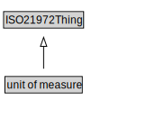

# unit of measure

<a href="../../diagrams/i72__unit of measure.dot.svg">Open interactive unit of measure diagram</a>

## Specializations of unit of measure

| Class | Description |
|-------|-------------|
| [compound unit](i72__compound unit.md) |  |
| [unit division](i72__unit division.md) |  |
| [unit exponentiation](i72__unit exponentiation.md) |  |
| [unit multiple or submultiple](i72__unit multiple or submultiple.md) |  |
| [unit multiplication](i72__unit multiplication.md) |  |

## Formalization for unit of measure

| Property | Constraint |
|----------|------------|
| subClassOf | ISO21972Thing |

## Used by classes

| Class | Property |
|-------|----------|
| [measure](i72__measure.md) | hasUnit |
| [measure](i72__measure.md) | unit_of_measure |
| [quantity](i72__quantity.md) | hasUnit |
| [quantity](i72__quantity.md) | unit_of_measure |

## Other annotations

| Annotation | Value |
|------------|-------|
| om-1::alternative_label | unit |
| om-1::alternative_label | unit of measurement |

